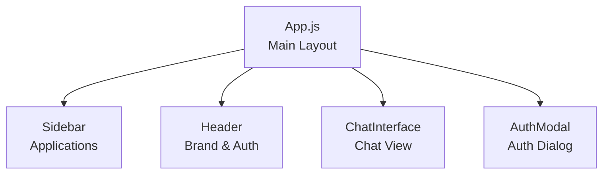
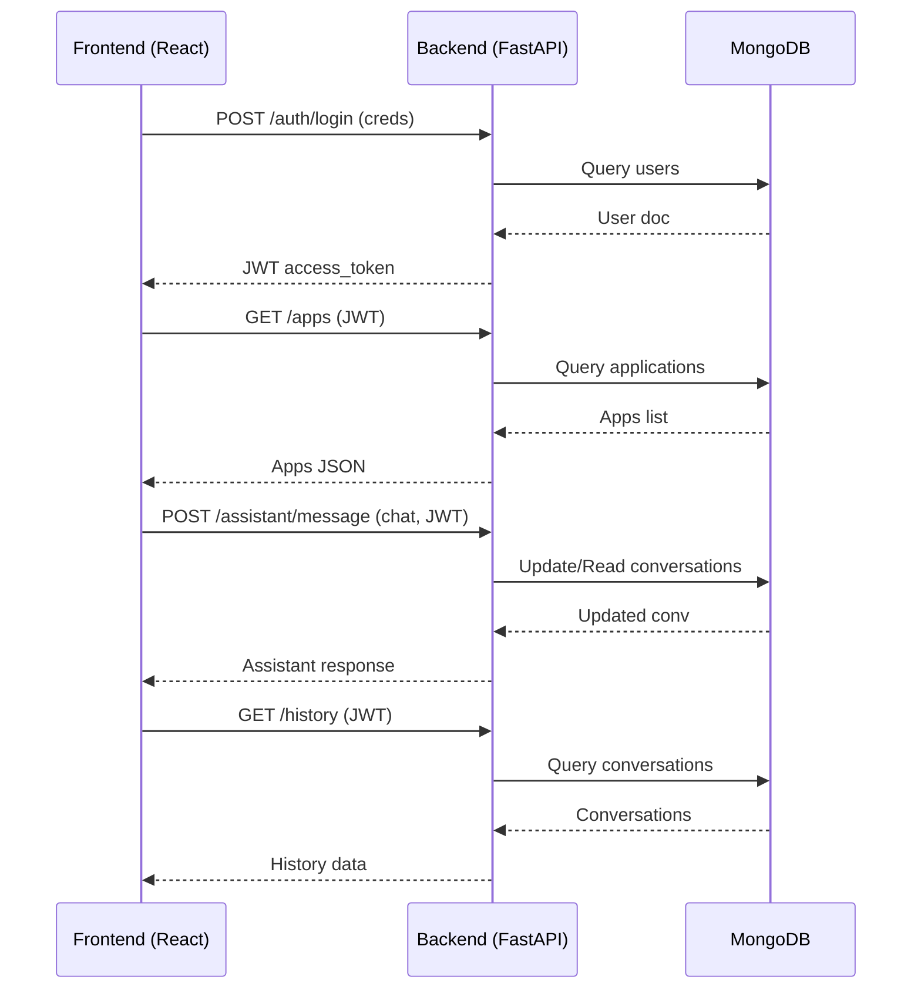
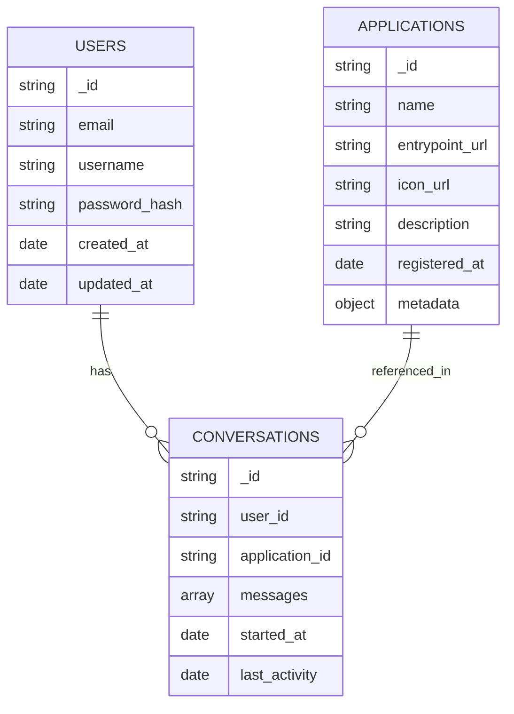

# Product Requirements Document (PRD) & Architecture Overview  
**Unified Assistant Chatbot Platform**  

---

## 1. Product Overview

### Purpose
The Unified Assistant Chatbot Platform provides a single point of entry for users to interact with a conversational assistant (similar to Siri) and access multiple underlying applications in an organized dashboard UI. The platform is designed to offer seamless, multi-app workflows via a conversational interface, simplifying user experience, authentication, and application launch.

### Target Users
- End users requiring a unified dashboard for interacting with multiple organizational or productivity applications via chat.
- Organizations aiming to offer a modern conversational and app-launch experience to their users.

---

## 2. Major Product Features

- **Conversational Assistant:** Acts as the home interface, greeting users upon login and handling conversations.
- **Authentication:** Secure login and registration system supporting JWT-based session management.
- **Application Dashboard:** Sidebar navigation to browse, select, and launch registered apps from within a single UI.
- **Chat Interface:** Functional chat, with conversation history, between user and assistant (per app or general).
- **Multiple App Integration:** Each app has metadata, launch URL, icon, and is presented via the assistant.
- **Full Responsive UI:** Modern dashboard supporting desktop and mobile views.
- **User/Conversation Management:** Persistent storage of users, conversations, and applications.
- **Backend API:** RESTful endpoints for authentication, assistant messaging, applications, and history.

---

## 3. Architecture Overview

### 3.1 Container Summary

| Container                | Type      | Technology   | Description                                                       |
|--------------------------|-----------|--------------|-------------------------------------------------------------------|
| chatbot_platform_frontend| Frontend  | React        | User dashboard, chat, app browser, authentication UI              |
| backend                  | Backend   | FastAPI      | Authentication, API, orchestration, business logic                |
| chatbot_platform_database| Database  | MongoDB      | Stores users, applications, and conversation data                 |

#### Data Flow
Users interact with the React Frontend. The frontend communicates securely via REST API to the FastAPI backend, which manages all business logic and data interaction with MongoDB.

---

### 3.2 System Architecture Diagram (Mermaid)

```mermaid
flowchart LR
    A[User<br/>Browser/Device]
    B[Frontend<br/>(React)]
    C[Backend<br/>(FastAPI API)]
    D[Database<br/>(MongoDB)]
    subgraph Platform
      B
      C
      D
    end

    A -->|HTTP(S)| B
    B -- API (REST/JSON) --> C
    C -- MongoDB Client --> D

    B -.->|Static hosting| A
```

---

## 4. Functional Description by Container

### 4.1 Chatbot Platform Frontend (React)
- **Directory:** `unified-assistant-platform-138295-38714/chatbot_platform_frontend/`
- **Purpose:** Modern dashboard with a sidebar for application navigation, a header for user/auth/account, and a main area for the chat assistant.
- **Main Components:**
  - `Sidebar`: Lists applications, triggers app selection.
  - `Header`: Brand logo, user info, login/logout.
  - `ChatInterface`: Conversational chat, displays history.
  - `AuthModal`: Login/Registration modal.
- **Key Features:**
  - Fetches application listing from `/apps` endpoint.
  - Maintains user session with JWT (token in localStorage).
  - Handles sending/receiving messages via `/assistant/message`.
  - Responsive CSS layout with support for dark/light mode toggle.
- **Integration:** Consumes REST API from FastAPI backend.

#### Component Diagram (Frontend)


---

### 4.2 Backend (FastAPI)

- **Directory:** `unified-assistant-platform-138295-38716/backend/`
- **Purpose:** Handles user authentication, app management, the assistant logic, access to persistent storage, and exposes a RESTful API to the frontend.
- **Key API Endpoints:**
  - `POST /auth/login` and `POST /auth/register`: Handles JWT-based authentication.
  - `GET /auth/me`: Current user info.
  - `GET /apps`: Lists available apps (requires auth).
  - `POST /apps/launch/{app_id}`: Launches/returns metadata for an application.
  - `POST /assistant/message`: Sends/receives message, updates conversation history.
  - `GET /history`: Retrieves conversation history.
- **Security:**
  - OAuth2 flow for token issuance.
  - Password hashes stored securely (bcrypt).
  - Environment variables used for MongoDB URI/DB and JWT secret.
- **Data Orchestration:** Uses pymongo for MongoDB communication.

#### Backend Major Flow (Mermaid)


---

### 4.3 Database (MongoDB)

- **Directory:** `unified-assistant-platform-138295-38715/chatbot_platform_database/`
- **Purpose:** Stores all user information, conversation logs, and registered application metadata.
- **Primary Collections:**
  - `users`: Stores user registration/auth info.
  - `conversations`: All chat histories, mapped to users and optionally to an app.
  - `applications`: Registered applications for selection/launch.
- **Initialization/Validation:**
  - JS scripts for initialization and schema validation in `db_init.js` and `schemas/`.
  - Indexes on user email/username and application name for uniqueness.

#### Database Collections Relationships (Mermaid)


---

## 5. Security & Environment

- Communications are secured via JWT; all sensitive endpoints require a valid token.
- Credentials and sensitive info (MongoDB URI, JWT secret) are passed only via environment variables (`MONGODB_URL`, `MONGODB_DB`, `JWT_SECRET_KEY`).
- CORS is enabled broadly for dev/demo; recommended to restrict origins in production.

---

## 6. Compliance and Code Quality

- Passwords never stored in plaintext; bcrypt hashing in backend.
- Data validation at API and DB schema levels.
- Code is modular, separation of concerns (auth, assistant, apps).
- All endpoints follow OpenAPI 3.0 and are discoverable in FastAPI’s OpenAPI docs (`/docs`).

---

## 7. Requirements Traceability

- [x] Authentication for users (register, login, session)
- [x] Conversational assistant interface
- [x] Application registry and launch from dashboard
- [x] Conversation history tied to user and optionally to app
- [x] API-driven communication between frontend and backend
- [x] Secure storage of user credentials
- [x] Environment configuration for secrets/URIs
- [x] Responsive, branded dashboard UI

---

## 8. Future / Extensibility Notes

- The assistant logic can be replaced with integration to an LLM or external NLP API.
- Applications may in future be full micro-frontends or remote microservices—API and DB models are ready for extension.
- Additional features (multi-factor auth, user roles, notifications, app workflow automation) can be added modularly.

---

## 9. Setup and Deployment

**Environment Configuration**
- Set MongoDB details (`MONGODB_URL`, `MONGODB_DB`) and backend JWT secret (`JWT_SECRET_KEY`) in container env for backend.
- Database setup is handled by `db_init.js` and shell scripts.

---

## 10. References

- [Frontend: unified-assistant-platform-138295-38714/chatbot_platform_frontend/README.md](../chatbot_platform_frontend/README.md)
- [Backend: unified-assistant-platform-138295-38716/backend/src/api/main.py](../../unified-assistant-platform-138295-38716/backend/src/api/main.py)
- [Database Model: unified-assistant-platform-138295-38715/chatbot_platform_database/DATABASE_MODEL.md](../../unified-assistant-platform-138295-38715/chatbot_platform_database/DATABASE_MODEL.md)

---

## 11. Appendix: API Endpoints (Summary)

| Endpoint                 | Method | Auth  | Purpose                        |
|--------------------------|--------|-------|--------------------------------|
| `/auth/register`         | POST   | No    | Register user                  |
| `/auth/login`            | POST   | No    | Obtain JWT                     |
| `/auth/me`               | GET    | Yes   | Current user info              |
| `/apps`                  | GET    | Yes   | List available apps            |
| `/apps/launch/{app_id}`  | POST   | Yes   | Launch/activate application    |
| `/assistant/message`     | POST   | Yes   | Send/receive assistant message |
| `/history`               | GET    | Yes   | User conversation history      |

---

**This document describes the current production-ready feature set and architecture. All technical, UI/UX, security, and integration requirements are implemented as described.**

